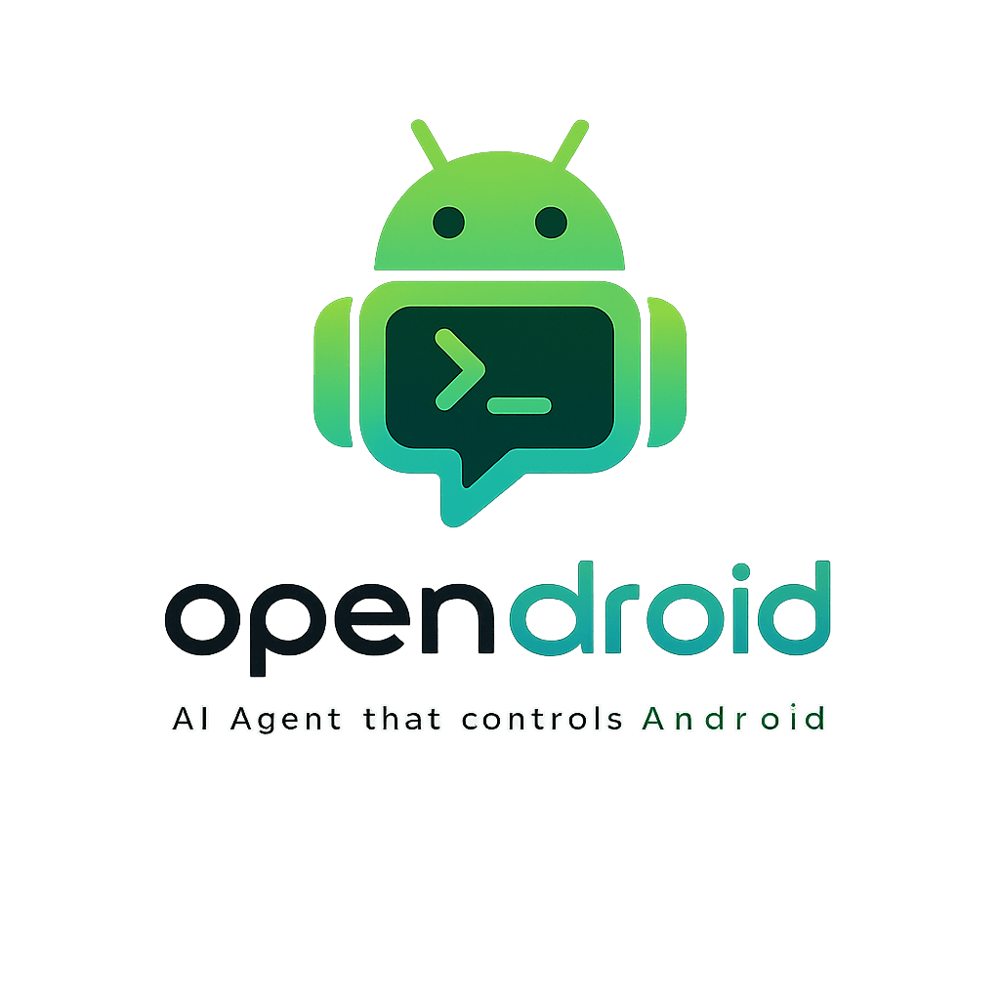
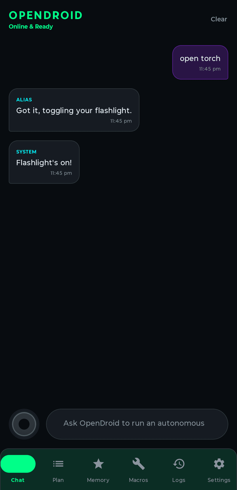
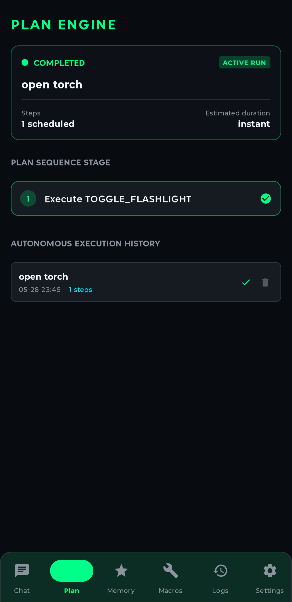
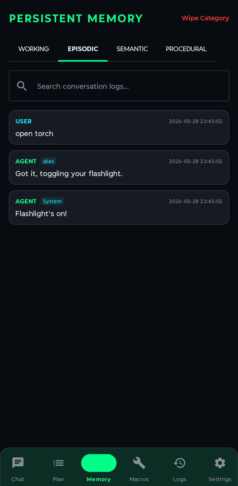
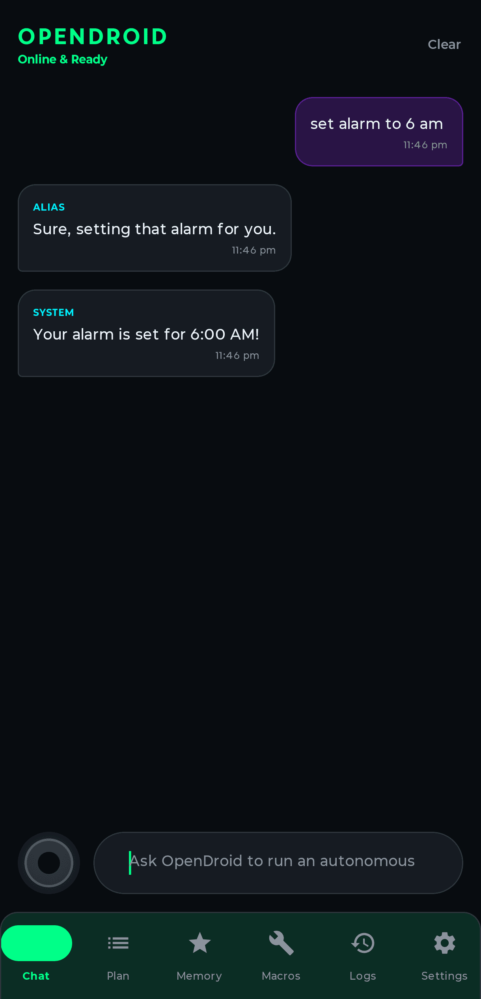

<p align="center">
  
</p>

<h1 align="center">OpenDroid</h1>

<p align="center">
  <strong>🤖 The Open-Source Autonomous AI Agent for Android</strong>
</p>

<p align="center">
  <em>Your phone. Your rules. Your AI.</em>
</p>

<p align="center">
  <code>CA: Coming Soon</code>
</p>

<p align="center">
  <a href="https://github.com/yashab-cyber/opendroid/releases"></a>
  <a href="https://github.com/yashab-cyber/opendroid/stargazers"></a>
  <a href="https://github.com/yashab-cyber/opendroid/blob/main/LICENSE"></a>
  <a href="https://discord.gg/knRMyFmvpp"></a>
</p>

<p align="center">
  <a href="https://www.producthunt.com/products/opendroid?embed=true&amp;utm_source=badge-featured&amp;utm_medium=badge&amp;utm_campaign=badge-opendroid" target="_blank" rel="noopener noreferrer"></a>
</p>

<p align="center">
  <a href="#-features">Features</a> •
  <a href="#-architecture">Architecture</a> •
  <a href="#%EF%B8%8F-getting-started">Get Started</a> •
  <a href="#-supported-llm-providers">Providers</a> •
  <a href="#-license">License</a>
</p>

---

> **📌 This is a fork.** `sudomarc/opendroid` is a personal fork of [`yashab-cyber/opendroid`](https://github.com/yashab-cyber/opendroid), kept specifically to iterate on the **marketing website** (the [`website/`](website/) folder — landing page, features/about/pricing pages, static assets). It is **not** where the Android app itself is developed. For the original project, the Android app, and the upstream issue tracker, go to [yashab-cyber/opendroid](https://github.com/yashab-cyber/opendroid). Website changes made on this fork don't sync automatically in either direction — see [`AGENTS.md`](AGENTS.md) for how agents working on this fork should treat the two remotes.

---

## 🎯 What is OpenDroid?

OpenDroid isn't just another chatbot. It's a **fully autonomous AI agent** that lives on your Android phone and actually *does things* for you.

> *"Check if it's going to rain tomorrow, and if so, text my wife that I'll be late and set an alarm for 6 PM."*

OpenDroid will **plan** this as 3 steps, **execute** each one, **verify** the results, and **adapt** if anything fails — all without you lifting a finger.

---

## ✨ Features

### 🧠 Autonomous Agent Engine
| Capability | Description |
|------------|-------------|
| **Self-Planning** | Breaks complex commands into sequential steps with dependency tracking |
| **Habit & Routine Detection** | Mines recurring daily app sequences (e.g. Gmail $\to$ Calendar $\to$ Slack at 9 AM) and offers one-click automated routines |
| **Re-Evaluation** | Monitors execution results and dynamically replans when steps fail |
| **Compound Intent Guard** | Smart detection of multi-action commands (e.g. "open WhatsApp *and* send message") |
| **Contact Disambiguation** | 4-tier contact resolution with fuzzy matching and relationship aliases ("call dad") |

### 🛠️ On-Device Model Manager (LiteRT-LM)
| Capability | Description |
|------------|-------------|
| **Background Downloader** | Real network downloads (via WorkManager) with Pause/Resume, cellular support, speed tracking, and ETA |
| **Secure Authentication** | Direct Android Keystore AES-GCM token storage to securely fetch gated Hugging Face models |
| **Integrity Verification** | Computes SHA-256 hashes and verifies LiteRT engine loading compatibility before marking READY |
| **Local Model Import** | Direct offline importing of catalog or freestanding custom `.task` / `.litertlm` files with JNI verification checks |

### 📱 Full Device Control
| Action | Examples |
|--------|----------|
| **System** | Brightness, WiFi, Bluetooth, Flashlight, DND, Volume, Screenshot |
| **Communication** | WhatsApp messages, Telegram messages/channels (`@user`), Calls, SMS, Email drafts |
| **Routines** | Morning briefings, agenda summaries, automated macro sequences |
| **Productivity** | Screen extraction ("Read & Remember"), Alarms, Timers, Reminders, Calendar events, Notes |
| **Navigation** | Google Maps directions, Uber/Ola booking |
| **Media** | Play/pause music, YouTube search, camera |
| **Finance** | UPI payments, bill splitting, currency conversion |
| **Smart Home** | Google Home device control |

### 👁️ Vision Engine & Screen Understanding
Captures screenshots via Accessibility API and feeds them to vision-capable LLMs for real-time screen analysis and **"Read & Remember"** multimodal meeting/note extraction. Falls back to accessibility tree text-scraping on older devices.

### 🗄️ 4-Tier Personal Knowledge Graph

```
┌─────────────────────────────────────────────────────────────┐
│                 Personal Knowledge Graph                    │
├──────────────┬──────────────┬────────────────┬──────────────┤
│ ⚡ Level 1   │  🧠 Level 2  │   📈 Level 3   │  🔒 Level 4  │
│  Temporary   │  Long-Term   │    Learned     │  Sensitive   │
│   (Active    │  (Explicit   │    Patterns    │ (Keystore    │
│    Plan)     │    Facts)    │  (Inferences)  │  Encrypted)  │
└──────────────┴──────────────┴────────────────┴──────────────┘
```

### 🎙️ Voice Interface
- **Offline wake word** detection — say *"OpenDroid"* to activate
- **Speech-to-text** for hands-free commands
- **Text-to-speech** with ElevenLabs premium voice support

### 🎨 Premium UI
Built with **Jetpack Compose** featuring a futuristic glassmorphic design:
- Deep navy (`#080C10`) + Neon green (`#00FF88`) color system
- Pulsing audio orb animation during listening
- Live latency benchmarks for each provider
- Dark mode by default

### 🎬 Meet OpenDroid in 3D

<p align="center">
  
</p>

<p align="center">
  <em>OpenDroid saying hi — rendered in 3D!</em>
</p>

> **Note:** If the video doesn't play inline on GitHub, [click here to download and watch it](assets/gemini_generated_video_90af62cc.mp4).

### 📸 Screenshots

<p align="center">
  
  &nbsp;&nbsp;
  
  &nbsp;&nbsp;
  
  &nbsp;&nbsp;
  
</p>

<p align="center">
  <em>Chat &bull; Plan Engine &bull; Memory System &bull; Alarm Control</em>
</p>

---

## 🏗️ Architecture

Clean architecture with **Dagger-Hilt** dependency injection:

```
com.opendroid.ai
│
├── 🤖 accessibility/      App automators (WhatsApp, SMS, Calls)
├── ⚡ actions/             60+ action executors across 10 modules
├── 🧠 core/
│   ├── agent/              AgentLoop, PlanManager, IntentClassifier, VisionEngine
│   ├── llm/                12 LLM providers, fallback chain, prompt engine
│   ├── memory/             4-tier memory system + notification intelligence
│   ├── security/           Direct Keystore provider credentials + legacy plaintext migration
│   ├── service/            Foreground service, notification listener, boot receiver
│   └── voice/              Wake word, speech recognition, TTS engine
│
├── 💾 data/
│   ├── db/                 Room database (7 DAOs, 7 entities, 3 migrations)
│   ├── models/             Unified data models (Plan, Memory, ChatMessage)
│   └── repository/         Repositories backed by Room & DataStore
│
├── 💉 di/                  Hilt modules (App, Database, LLM)
└── 🎨 ui/
    ├── theme/              Glassmorphic design system
    ├── screens/            16 screens (Chat, Plan, Memory, Settings, etc.)
    ├── viewmodel/          8 ViewModels
    └── components/         Reusable Compose components
```

---

## 🔌 Supported LLM Providers

OpenDroid supports **12 LLM providers** with automatic failover:

| Provider | Models | Type |
|----------|--------|------|
| 🟢 **Google Gemini** | Gemini 2.0 Flash, Pro, Nano | Cloud + On-device |
| 🟣 **Anthropic Claude** | Claude Sonnet 4, Opus 4 | Cloud |
| 🔵 **OpenAI** | GPT-4o, GPT-4.1, o3 | Cloud |
| ⚡ **Groq** | LLaMA 3, Mixtral (ultra-fast) | Cloud |
| 🔷 **DeepSeek** | DeepSeek V3, R1 | Cloud |
| 🟠 **Mistral AI** | Mistral Large, Medium | Cloud |
| 🌐 **OpenRouter** | 200+ models via unified API | Cloud |
| 🤝 **Together AI** | Open-source model hosting | Cloud |
| 🔴 **Cohere** | Command R+ | Cloud |
| 🐙 **GitHub Copilot** | GPT-4.1, Claude via Copilot API | Cloud |
| 🏠 **Ollama** | Any local model (LLaMA, Phi, etc.) | Local |
| 🔧 **Custom OpenAI** | Any OpenAI-compatible endpoint | Self-hosted |

> **Smart Fallback**: If your primary provider fails, OpenDroid automatically tries the next available provider in the chain.

---

## ⚡️ Getting Started

### Prerequisites
- **JDK 21** — not newer. The project compiles against Java 21 (`jvmToolchain(21)`). `gradle/gradle-daemon-jvm.properties`
  makes `./gradlew` select an installed JDK 21 automatically, so you do not have to
  change `JAVA_HOME` — but a JDK 21 must be installed.
- **Android SDK 35** (Android 15)

### Build & Install

```bash
# Clone this fork (website work happens here)
git clone https://github.com/sudomarc/opendroid.git
cd opendroid

# Build debug APK
./gradlew assembleDebug

# APK output location
# → app/build/outputs/apk/debug/app-debug.apk
```

> For Android app development (not website work), clone the upstream instead: `git clone https://github.com/yashab-cyber/opendroid.git`

### Required Permissions

On first launch, OpenDroid will guide you through granting:

| Permission | Why |
|------------|-----|
| 🔓 **Accessibility Service** | UI automation, screen reading, app control |
| ⚙️ **Write Settings** | Toggle WiFi, Bluetooth, brightness |
| 🎤 **Record Audio** | Wake word detection & voice commands |
| 🔔 **Notification Access** | Smart notification reading & auto-reply |
| 📱 **Post Notifications** | Foreground service status |

### Configure LLM

In **Settings**, add your API key for any supported provider. OpenDroid works best with:
- **Gemini** (free tier available)
- **Groq** (fastest inference)
- **Ollama** (fully offline)

---

## 🔒 Security

Found a vulnerability? Please report it responsibly.
See [SECURITY.md](docs/SECURITY.md) for details.

---

## ⭐ Star History


<a href="https://www.star-history.com/?repos=yashab-cyber%2Fopendroid&type=date&legend=top-left">
 <picture>
   <source media="(prefers-color-scheme: dark)" srcset="https://api.star-history.com/chart?repos=yashab-cyber/opendroid&type=date&theme=dark&legend=top-left&sealed_token=_Y78t8Ar-D4NNqkSXt6ARVN22DZYznwQAD5wzR40TUgqtwjvMk5dU9wruh4XFvB5MkstKgAkNa1imj3B_TFGFcZkSEuKdTVmDTeay8Tnp2cYn3H4gDp_3A" />
   <source media="(prefers-color-scheme: light)" srcset="https://api.star-history.com/chart?repos=yashab-cyber/opendroid&type=date&legend=top-left&sealed_token=_Y78t8Ar-D4NNqkSXt6ARVN22DZYznwQAD5wzR40TUgqtwjvMk5dU9wruh4XFvB5MkstKgAkNa1imj3B_TFGFcZkSEuKdTVmDTeay8Tnp2cYn3H4gDp_3A" />
   
 </picture>
</a>
 

---

## 📜 License

```
Copyright 2026 OpenDroid Contributors
Last Updated: August 18, 2026

Licensed under the Apache License, Version 2.0 (the "License");
you may not use this file except in compliance with the License.
You may obtain a copy of the License at

    http://www.apache.org/licenses/LICENSE-2.0

Unless required by applicable law or agreed to in writing, software
distributed under the License is distributed on an "AS IS" BASIS,
WITHOUT WARRANTIES OR CONDITIONS OF ANY KIND, either express or implied.
See the License for the specific language governing permissions and
limitations under the License.
```


---

<p align="center">
  Made with ❤️ by <a href="https://github.com/yashab-cyber"><strong>Yashab Alam</strong></a>
</p>

<p align="center">
  <a href="https://github.com/yashab-cyber/opendroid">⭐ Star the original repo</a> if OpenDroid has helped you — this fork (<a href="https://github.com/sudomarc/opendroid">sudomarc/opendroid</a>) maintains the website only.
</p>
