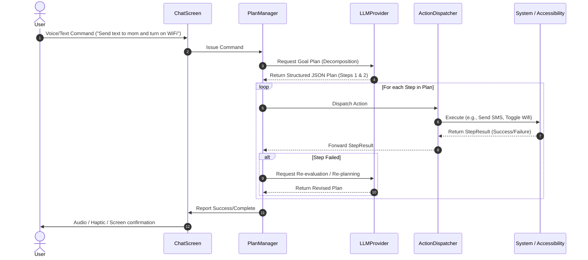

# System Architecture - OpenDroid

This document provides a detailed breakdown of OpenDroid's architectural layers, component relationships, data flow, and core design principles.

---

## 1. Architectural Layers (Clean Architecture)

OpenDroid follows a strict Clean Architecture pattern. By separating concerns, components can be developed, tested, and updated independently.

```
                      ┌─────────────────────────────────┐
                      │       Presentation Layer        │
                      │  (Compose Screens, ViewModels)  │
                      └────────────────┬────────────────┘
                                       │ State & Event Flow
                                       ▼
                      ┌─────────────────────────────────┐
                      │          Domain Layer           │
                      │ (PlanManager, Exec, Interfaces) │
                      └────────────────┬────────────────┘
                                       │ Data Boundary Interfaces
                                       ▼
                      ┌─────────────────────────────────┐
                      │           Data Layer            │
                      │ (Room, DataStore, API clients)  │
                      └─────────────────────────────────┘
```

### 1.1. Presentation Layer (`com.opendroid.ai.ui`)
* **Compose UI Screens:** Purely visual representations of the current state (`ChatScreen`, `SettingsScreen`, `PlanScreen`, `MacrosScreen`, `NotificationHistoryScreen`).
* **ViewModels:** Hold screen state and interact directly with domain engines or data repositories (e.g., `SettingsViewModel`, `AutoReplyViewModel`).

### 1.2. Domain Layer / Core (`com.opendroid.ai.core`)
* **PlanManager & ReEvaluationEngine:** Executes AI agent workflows, orchestrating how multi-step instruction lists are evaluated and processed.
* **BaseAction & Action Types:** Interface specifying how individual actions run, providing uniform execution parameters across Native controls, Communications, and Productivity utilities.
* **Accessibility Services:** Autonomous interface drivers interacting directly with third-party app layouts.

### 1.3. Data Layer (`com.opendroid.ai.data`)
* **Room Database:** Houses all structured information (`NotificationHistory`, `SemanticFacts`, `Macros`).
* **Repositories:** Act as unified data managers, fetching and merging content from local cache and remote network endpoints.

---

## 2. Core Execution Flow (Agentic Loop)

The typical data flow when a user issues a command (voice or text) is as follows:



---

## 3. Dependency Injection (Hilt Modules)

Global dependencies are scoped and supplied via Dagger-Hilt modules under `com.opendroid.ai.di`:
1. **`AppModule`:** Provides Context, OkHttpClient, and shared Datastore manager instances.
2. **`DatabaseModule`:** Builds the Room database singleton and exposes specific DAOs (`NotificationDao`, `MacroDao`, etc.).
3. **`LLMModule`:** Injects provider factories to construct instances of OpenAI, Gemini, Ollama, Anthropic, or other LLM integrations based on settings preferences.
