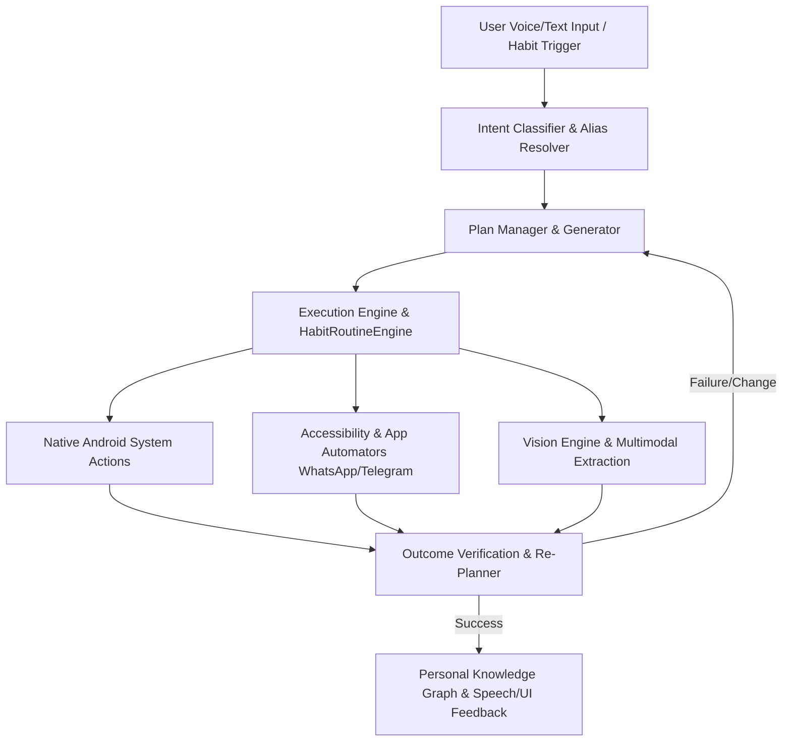

# Product Requirement Document (PRD) - OpenDroid

## Document Control
* **Document Version:** v1.2.0
* **Last Updated:** August 20, 2026
* **Status:** Approved
* **Author:** yashab-cyber

---

## 1. Executive Summary & Vision

OpenDroid is a production-ready, autonomous, self-planning AI agent for Android devices. Unlike standard chat-based AI assistants (such as Google Assistant or Siri) that rely on static, hardcoded APIs or simple keyword matching, OpenDroid operates as a fully autonomous agentic system. 

It interprets high-level natural language user instructions, breaks them down into sequential sub-tasks (a "Plan"), executes those tasks using native system interfaces and screen-based Accessibility actions, evaluates the outcomes, and dynamically adjusts/replans if a step fails or device conditions change.

### The Mission
To build a private, open-source, and fully autonomous agentic layer that gives users hands-free, complete control over their mobile devices using state-of-the-art Large Language Models (LLMs) running both locally (offline) and in the cloud.

---

## 2. Problem Statement & User Pain Points

1. **Fragmented App Ecosystems:** Apps do not talk to each other. Automating a workflow like *"Checking if a flight is delayed, emailing my boss about it, and ordering an Uber to the new time"* requires manually hopping between three separate apps.
2. **Brittle Assistant APIs:** Traditional voice assistants fail when they encounter apps without official developer APIs. They cannot click buttons, scroll feeds, or type into text boxes on third-party layouts.
3. **Privacy Concerns:** Commercial AI assistants process all voice and personal data on remote servers. Users require an assistant that can run completely offline using local models (e.g., LiteRT-LM, Ollama).
4. **Lack of Agentic Loops:** Existing tools cannot handle failure. If a network call fails, or a button isn't visible, they stop. They lack a feedback loop to try an alternative approach or ask for human-in-the-loop confirmation.
5. **No Habit Learning or Proactivity:** Traditional assistants only act when explicitly asked every single time; they do not learn recurring daily habits (e.g. checking Gmail, Calendar, Slack every morning at 9:00 AM) or offer to automate them.

---

## 3. Core Features & Capabilities

### 3.1. Autonomous Planning & Re-Evaluation (PlanManager)
* **Goal Decomposition:** Convert multi-step instructions into a structured JSON execution plan (directed acyclic graph of actions).
* **Dynamic Re-planning:** During execution, verify the outcome of each step. If a step fails, the planner regenerates the remaining sequence (e.g., using a fallback method or altering parameters).
* **Safe Intent Guards:** Intercept complex compound phrases (e.g., *"and then text Dad"*) to ensure they are handled by the planning engine rather than single action dispatchers.

### 3.2. Device & System Control Actions
* **Native System Controls:** Adjust screen brightness, volume, Wi-Fi, Bluetooth, flashlight, and device lock state.
* **Productivity:** Set alarms, schedule timers, search/create calendar events, translate text, and fetch real-time device battery/network status.
* **Omni-Channel Communications:**
  * **Phone Calls & SMS:** Search contacts using phonetic and nickname-matching fallback logic. Draft and send SMS or call contacts directly, falling back to system intents if direct permissions are not granted.
  * **WhatsApp Automation:** Direct contact messaging, group messaging, and auto-replying via `WhatsAppAutomator`.
  * **Telegram Automation:** Direct messaging to `@username` handles, contact address book matches, and international phone numbers via `TelegramAutomator` across official Telegram, Telegram Web/FOSS, Plus Messenger, and NekoX.

### 3.3. Accessibility & Vision Automation
* **UI Interaction Service (`OpenDroidAccessibilityService`):** Click buttons, inject text, scroll list containers, and navigate layouts in third-party apps.
* **Multimodal Vision Engine:** Capture real-time screenshots using the Accessibility media projections (Android 11+) and feed them to vision-capable models (e.g., Gemini Flash) for layout and step verification.
* **Text-Scraping Fallback:** On older devices or where screenshot permissions are missing, scrape the active window's node hierarchy tree to reconstruct layout state.

### 3.4. Screen Understanding → “Read & Remember”
* **Multimodal Screen Extraction:** `extractAndStructureScreenInfo` extracts structured event details (*Title, Date, Time, Location, Participants, Action Items*), summaries, and notes from any screen.
* **`READ_AND_REMEMBER_SCREEN` Action:** Saves screen information into persistent memory.
* **`RECALL_MEMORY` Action:** Recalls saved screen notes, facts, and past meeting details via natural language queries.

### 3.5. 4-Tier Personal Knowledge Graph (PersonalGrowthEngine)
Structured intelligence memory model organized into entity nodes (`KnowledgeNode`), categories, and relations (`KnowledgeRelation`):
1. **⚡ Level 1: Temporary Memory (`TEMPORARY`):** Transient plan variables, current conversation context, and working state.
2. **🧠 Level 2: Long-Term Memory (`LONG_TERM`):** Explicit user facts, active projects, and custom preferences with confidence `1.0`.
3. **📈 Level 3: Learned Patterns (`LEARNED_PATTERN`):** Behaviors inferred from activity (frequently contacted people, preferred media apps, ride hailing choices, recurring alarm routines, frequent websites) with dynamic confidence scoring (50% → 85% → 95%).
4. **🔒 Level 4: Sensitive Data (`SENSITIVE`):** Confidential user secrets (passwords, PINs, tokens) encrypted at rest using Android Keystore AES-256-GCM via `SensitiveMemoryStore`.

### 3.6. Habit & Routine Detection Engine (HabitRoutineEngine)
* **Continuous Background Habit Mining:** Intercepts foreground app switches via Accessibility events (with debouncing) and clusters user activities into 30-minute time windows across days of the week.
* **Sequence Mining & Routine Synthesis:** Detects repeated patterns (e.g., user opens *Gmail $\to$ Calendar $\to$ Slack $\to$ Chrome* at 9:00 AM on weekdays).
* **Proactive Suggestion Prompts:** Prompts user: *"I noticed you usually do these tasks every weekday morning. Would you like me to automate them?"*
* **Multi-Step Morning Routine Automation:**
  1. Read calendar (`LIST_CALENDAR_TODAY`)
  2. Summarize upcoming meetings (`GET_MORNING_BRIEFING`, `section = "schedule"`)
  3. Check important notifications (`READ_NOTIFICATIONS`)
  4. Prepare task list (`READ_NOTES`)
  5. Read selected messages (`READ_NOTIFICATIONS`)
  6. Deliver morning briefing (`GET_MORNING_BRIEFING`, `section = "full"`)
* **One-Click Approval to Scheduled Macros:** Approval registers automated recurring cron jobs in `MacroDao` and logs habit facts in `PersonalGrowthEngine`.

### 3.7. On-Device Model Downloader & Manager (LiteRT-LM)
* **Background Downloading:** Download offline LiteRT models (`.task`/`.litertlm`) in the background via Jetpack WorkManager with pause, resume (HTTP Range), and cellular network support with carrier charge warnings.
* **Hugging Face Authentication:** Android Keystore-backed token management verified via `whoami-v2`.
* **Integrity & Compatibility Verification:** Validates SHA-256 hashes, file size, and JNI engine loading compatibility (fixing false `FORMAT_INVALID` errors on models like Gemma 4 e2b-it and Qwen).
* **Local Model Import:** Sandboxed local file importing with JNI verification.

---

## 4. User Interface & Design Requirements

The user interface follows a **Premium Glassmorphic Cyberpunk** aesthetic.

* **Color Palette:**
  * Background: Deep Space Navy (`#080C10`)
  * Accent / Highlights: Neon Green (`#00FF88`), Cyber Cyan (`#00E5FF`), Electric Violet (`#8B5CF6`)
  * Surfaces: Dark Gray Cardboard (`#121820`) with semi-transparent borders.
* **Key Screen Mockups & Flows:**
  1. **Chat Screen:** Futuristic messaging interface with real-time API latency benchmarks and audio visualizer.
  2. **Plan Screen:** Step-by-step decomposed DAG plan with live execution status spinners and outcome checks.
  3. **Routines Screen (`RoutinesScreen`):** Discovered routine suggestions with confidence tags, one-click approve/dismiss buttons, active routine management, template presets (*Morning Routine*, *Work Focus*, *Evening Wrap-up*), and habit analytics.
  4. **Growth Graph Screen (`MemoryScreen`):** 4-tier interactive visualizer for temporary, long-term, learned patterns, and encrypted sensitive records.
  5. **Settings Screen:** Dynamic model discovery from provider endpoints (OpenAI, Gemini, Ollama, Groq, Cohere, OpenRouter), API key management, and on-device model manager.

---

## 5. Security & Permission Management

* **Data Security Requirement:** API Keys and user secrets must not be stored in plaintext. They are encrypted at rest using direct Android Keystore AES-256-GCM envelopes.
* **Accessibility Privacy:** Scraped layout hierarchies, texts, and screenshots are processed locally or sent only to the user-authorized LLM endpoint over HTTPS.
* **Plan Approval Safety Modes:**
  * `OFF`: Requires confirmation for every generated plan.
  * `AUTO`: Automatically executes actions on the user's explicit allowlist; requires confirmation for actions marked `neverAutoApprove`.
  * `YOLO`: Executes all plans autonomously upon user opt-in.

---

## 6. Technical Stack & Dependencies

* **Core Platform:** Kotlin 2.4.0, Jetpack Compose BOM 2026.06.01, Jetpack Lifecycle 2.8.7
* **Dependency Injection:** Dagger-Hilt 2.60.1
* **Database:** Room DB 2.8.4 (SQLite, Schema v8)
* **Local Settings:** DataStore Preferences 1.1.1
* **Serialization:** Kotlinx Serialization JSON 1.8.1
* **Network Client:** OkHttp 5.4.0 BOM & Retrofit 3.0.0
* **On-Device AI:** LiteRT-LM Android 0.14.0, ML Kit GenAI Prompt API
* **Minimum SDK:** Android 26 (Android 8.0 Oreo)
* **Target SDK:** Android 36 (Android 16)
