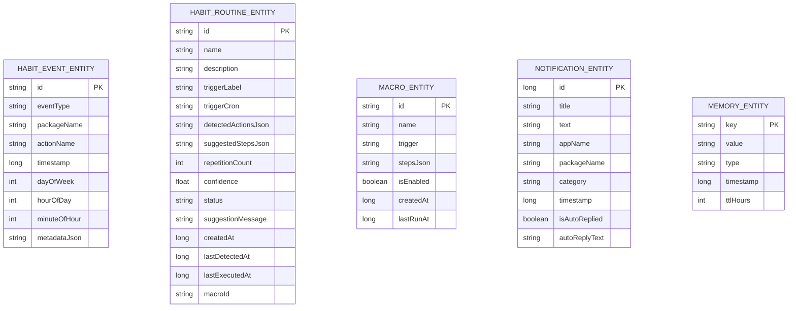

# Technical Requirement Document (TRD) - OpenDroid

## Document Control
* **Document Version:** v1.2.0
* **Last Updated:** August 20, 2026
* **Status:** Approved
* **Author:** yashab-cyber

---

## 1. System Architecture

OpenDroid is structured according to **Clean Architecture** principles. The codebase is decoupled into three primary layers: Presentation, Domain (Core), and Data. Dependency injection is managed globally via Dagger-Hilt.

```
                  ┌─────────────────────────┐
                  │   Presentation Layer    │
                  │   (Jetpack Compose UI)  │
                  └────────────┬────────────┘
                               │ (State & Events)
                               ▼
                  ┌─────────────────────────┐
                  │    Domain/Core Layer    │
                  │ (PlanManager, AgentLoop,│
                  │  HabitRoutineEngine,    │
                  │  PersonalGrowthEngine)  │
                  └────────────┬────────────┘
                               │ (Repositories & Interfaces)
                               ▼
                  ┌─────────────────────────┐
                  │       Data Layer        │
                  │  (Room DB v8, DataStore,│
                  │   Retrofit, OkHttp)     │
                  └─────────────────────────┘
```

### 1.1. Core Components

* **PlanManager & ReEvaluationEngine:** The central orchestrator of agent actions. It calls LLM providers to decompose high-level commands, tracks DAG step execution status, and executes dynamic replanning on step failures.
* **HabitRoutineEngine:** Tracks user activity sessions across 30-minute time buckets, mines recurring sequential app patterns (e.g. Gmail $\to$ Calendar $\to$ Slack), proactively suggests automations, and executes multi-step morning briefings.
* **PersonalGrowthEngine:** Manages a 4-tier Personal Knowledge Graph (Temporary, Long-Term, Learned Patterns with dynamic confidence scoring, and Hardware-Encrypted Sensitive Data).
* **OpenDroidAccessibilityService:** Captures window state change events for habit tracking, scrapes active window node hierarchies, and executes gestures and clicks.
* **App Automators:**
  * `WhatsAppAutomator`: Automates typing and sending on WhatsApp.
  * `TelegramAutomator`: Automates typing and sending across official Telegram, Telegram Web/FOSS, Plus Messenger, and NekoX.
  * `SmsAutomator`: Automates system SMS composers.
* **ActionDispatcher:** Routes plan steps to action handlers (`SystemActions`, `CommunicationActions`, `RoutineActions`, `ProductivityActions`, `MediaActions`, `SmartHomeActions`, etc.).

---

## 2. Database Schema & Models

OpenDroid utilizes a local SQLite database managed via Android's Room DB library (Current Schema Version: `8`).

### 2.1. Room Entities



* **HabitEventEntity:** Logs foreground app launches and agent executions indexed by `timestamp`, `dayOfWeek`, and `hourOfDay`.
* **HabitRoutineEntity:** Stores mined recurring habit patterns, suggested DAG steps, confidence scores, and lifecycle states (`SUGGESTED`, `APPROVED`, `ACTIVE`, `PAUSED`, `DISMISSED`).
* **MacroEntity:** Stores automated multi-step action routines with cron triggers.
* **NotificationEntity:** Logs captured notifications for morning briefings and auto-replies.
* **MemoryEntity:** Stores tiered facts, screen extraction notes, and user preferences.

---

## 3. Subsystem Technical Specifications

### 3.1. Habit & Routine Detection Subsystem
1. **Activity Interception:** `OpenDroidAccessibilityService.onAccessibilityEvent` receives `TYPE_WINDOW_STATE_CHANGED` events, applies a 1500ms debounce threshold, and resolves friendly package names.
2. **Session Clustering:** Groups events into calendar days and 30-minute time buckets (`EARLY_MORNING`, `MORNING`, `MIDDAY`, `AFTERNOON`, `EVENING`, `NIGHT`).
3. **Sequence Mining:** Identifies sequences appearing $\ge 3$ times across a 14-day window.
4. **Archetype Synthesis:** Synthesizes structured 6-step Morning Routines (`LIST_CALENDAR_TODAY`, `GET_MORNING_BRIEFING`, `READ_NOTIFICATIONS`, `READ_NOTES`).
5. **Macro Bridge:** One-click approval converts the detected routine into an active scheduled macro in `MacroDao`.

### 3.2. Telegram Automation Subsystem
1. **URI Resolution:** Handles `tg://resolve?domain=<user>&text=<msg>` for usernames and `tg://msg?to=<phone>&text=<msg>` for numbers, falling back to `https://t.me/<domain>`.
2. **Package Dispatch:** Detects installed Telegram clients (`org.telegram.messenger`, `org.telegram.messenger.web`, `org.telegram.plus`, `nekox.messenger`).
3. **Accessibility Automation (`TelegramAutomator`):** Locates input nodes (`chat_text_edit`, `chat_message_text`), inputs text, and clicks send buttons (`send_button`, `chat_send_button`).

### 3.3. Multi-Tier Personal Knowledge Graph
1. **Node Schema:** `KnowledgeNode(id, label, category, tier, summary, properties, confidence, source)`.
2. **Dynamic Confidence:** Inferred patterns upgrade confidence scores based on repetition (50% $\to$ 85% $\to$ 95%).
3. **Hardware-Encrypted Level 4:** Sensitive secrets are encrypted with Android Keystore AES-256-GCM authenticated data via `SensitiveMemoryStore`.

---

## 4. API & Integration Specs

### 4.1. LLM Client Integration
Every LLM provider implements the `LLMProvider` interface:

```kotlin
interface LLMProvider {
    suspend fun generateCompletion(prompt: String, systemPrompt: String?): Result<String>
    suspend fun fetchModels(): Result<List<AIModel>>
}
```

Standardized dynamic endpoints:
* **Gemini:** `https://generativelanguage.googleapis.com/v1beta/models`
* **OpenAI / OpenRouter / Groq / DeepSeek:** Dynamic discovery via `/v1/models`
* **Anthropic Claude:** `https://api.anthropic.com/v1/messages`
* **Ollama (Local/Offline):** `${ollamaUrl}/api/tags`

---

## 5. Build Toolchain & Dependencies

* **Target SDK:** `36` (Android 16) | **Min SDK:** `26` (Android 8.0)
* **Gradle:** `9.7.0` | **AGP:** `9.3.1` | **Kotlin:** `2.4.0` | **Compose BOM:** `2026.06.01`
* **Room:** `2.8.4` (KSP compiler, explicit migrations 1 through 8)
* **Hilt:** `2.60.1` | **WorkManager:** `2.11.2` | **OkHttp:** `5.4.0` | **Retrofit:** `3.0.0`
* **LiteRT-LM:** `0.14.0` | **GenAI Prompt API:** `1.0.0-beta2`
